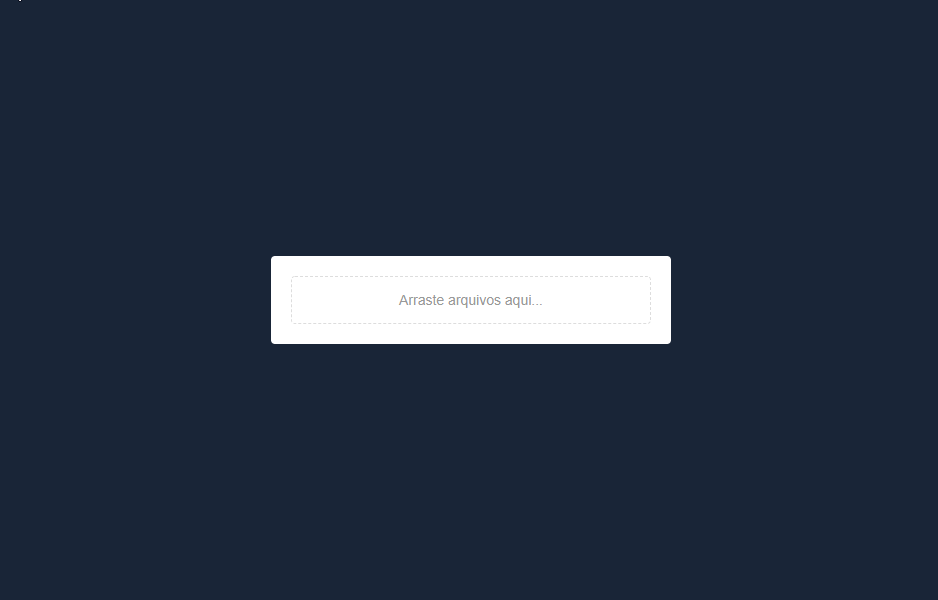

<h3 align="center">Projeto de upload de imagens para banco de dados AWS S3 em produção e MongoDB em desenvolvimento.</h3>

> Obs: Arquivos de até 2mb.

## 🚀 Telas aplicação web 

	

<h2><strong>:satellite:Tecnologias utilizadas:</strong></h2>

<h3>NodeJS  </h3>
<h3>ReactJS  </h3>
<h3>AWS S3  </h3>
<h3>MongoDB </h3> 

<h3>Link do projeto em produção:</h3>
<a href="https://uploadimage-frontend-reactjs.herokuapp.com/" target="_blank">Upload Image no Heroku</a>

<h3>Frontend</h3>
<a href="https://github.com/marcomonteirobrito/uploadImage-frontend-reactjs" target="_blank>Repositório frontend</a>
---

<h4>Dúvidas entre em contato pelo <a href="https://www.linkedin.com/in/marco-antonio-monteiro-de-brito-541ba0144/" target="_blank">Linkedin</a> </h4>

<h4 align="center"> <em>&lt;/&gt;</em> by <a href="https://github.com/marcomonteirobrito" target="_blank">marcomonteirobrito</a> </h4>